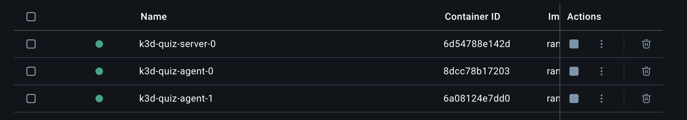

# K3D - Lightweight Kubernetes Tutorial

## 1. Schritt Kubernetes-Cluster erstellen


- Unser Ziel, ist es, wie im Bild zu sehen, das grundlegende Cluster erstmal zu erstellen
- Cluster werden genutzt, um voneinander getrennte Umgebungen zu erstellen (z.B. PROD + DEV)

```bash
k3d cluster create quiz --port "8080:80@loadbalancer" --agents 2
```

- `k3d`: Kubernetes Programm
- `cluster`: Wir möchten den "Service" cluster ansprechen
- `create`: Die Aktion `create ausführen`
- `--port`: Port `8080` von unserer Maschine auf den Port 80 von dem Cluster mappen wollen (da läuft der Loadbalancer)
- `--agents 2`: Fügt 2 worker nodes hinzu

### Überprüft, dass alles geklappt hat:

- Docker container überprüfen (sollte so aussehen):
  
- `kubectl get nodes` sollten folgendes ergeben:

```bash
NAME                STATUS   ROLES                  AGE   VERSION
k3d-quiz-agent-0    Ready    <none>                 76s   v1.33.6+k3s1
k3d-quiz-agent-1    Ready    <none>                 76s   v1.33.6+k3s1
k3d-quiz-server-0   Ready    control-plane,master   79s   v1.33.6+k3s1
```
