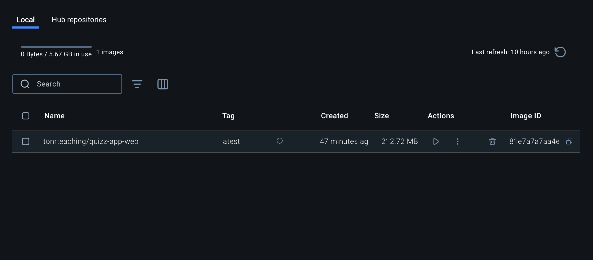

# Docker Getting started

## Vorab

1. `git clone git@github.com:tomschiffmann-teaching/03-dido-quiz-app-draft.git` von diesem Repository
2. Den `.git` Ordner löschen, um mein repository von der Projektmappe zu trennen

## Docker Images bauen

1. [./Dockerfile](./Dockerfile) muss vorhanden sein, da es die "Anleitung" für das bauen der finalen App ist
2. `docker build -t tomteaching/draft-quiz-app ./` --> Der Pfad muss auf das Verzeichnis verweisen, wo das Dockerfile liegt

- `docker build -t <docker-hub-username>/<image-name> <Verzeichnis-mit-Dockerfile>`
  

3. `docker run -p 3010:3000  tomteaching/draft-quiz-app`
   Allgemein: docker run -p <Host-Port>:<Docker-Port> <docker-hub-username>/<app-name>

- Host-Port: Der Port auf eurem lokalen Betriebssystem (z.B. Windows, Mac, etc.)
- Docker-Port : Der Port auf dem eure App innerhalb von Docker läuft
  <docker-hub-username>/<app-name>: Der Image Name, welcher gestartet werden soll (siehe Screenshot oben als Beispiel)

## Docker Image auf Docker Hub deployen

1. Authentifizierung auf Docker Hub über `docker login`
2. [https://hub.docker.com/repository/](https://hub.docker.com/repository/) aufrufen und neues Repository erstellen

- Nennt das repository zunächst erstmal genauso wie euer image (den Teil von `<app-name>`: Das was hinter dem slash steht von `<docker-hub-username>/<app-name>`)

3. `docker tag  tomteaching/draft-quiz-app  tomteaching/draft-quiz-app:latest`

- `docker tag <unser-lokales-image> <remote-image>:<version>`

4. `docker push tomteaching/draft-quiz-app:latest`
   - `docker push <remote-image>:<version>`
5. Unter [https://hub.docker.com/repository/](https://hub.docker.com/repository/) überprüfen ob die hochgeladene Version auch vorhanden
6. Über Docker Desktop alle Container löschen und auch alle Images löschen
7. Einmal überprüfen, dass app nicht mehr läuft
8. `docker pull tomteaching/draft-quiz-app:latest`

- `docker pull <image>`

9. `docker run -p 3010:3000 tomteaching/draft-quiz-app`

- `docker run -p <Host-Port>:<Docker-Port> <docker-hub-username>/<app-name>`

## Docker Compose

- Docker Compose ermöglicht die Definition mehrerer services
- Erleichtert Entwicklungen und ihre abhängigkeiten
- Fährt alle dort definierten services hoch und auch wieder herunter

1. Guckt euch in Docker Desktop eure Volumes an
2. Kopiert euch aus diesem repo die [./docker-compose.yml](./docker-compose.yml) und zusätzlich das gesamte [./monitoring/](./monitoring/) Verzeichnis
3. Danach einfach `docker compose up -d`
4. Volumes Reiter in Docker Desktop nochmal angucken
5. Gucken, dass die apps auf [http://localhost:3000](http://localhost:3000) und [http://localhost:3001](http://localhost:3001)
6. Danach die apps wieder herunterfahren mit `docker compose down`
7. Überprüfen, dass die services nicht mehr laufen
8. Volumes Reiter in Docker Desktop nochmal angucken
9. In der Entwicklung wird auch häufig die Option `docker compose down -v` verwendet, um die lokalen Volumes mit zu löschen. Also einmal `docker compose down -v` ausführen
10. Volumes Reiter in Docker Desktop nochmal angucken
